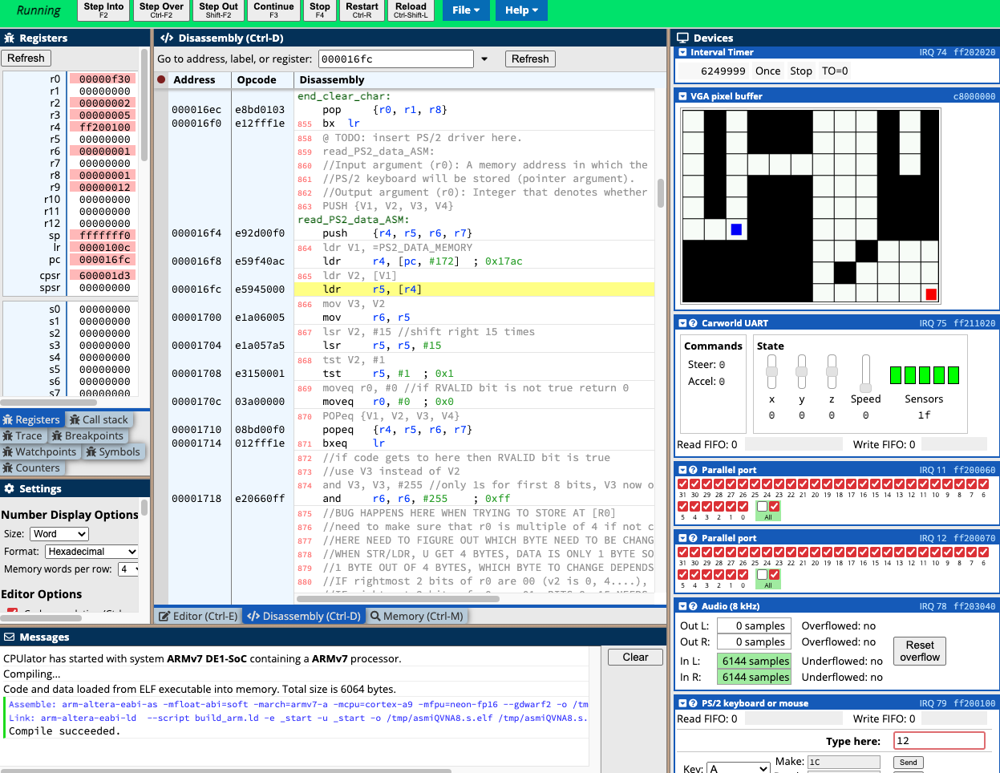

# LabyrinthGame

Labyrinth game programmed in ARMv7 assembly.

## Run it for yourself!
Head over to [here](https://ecse324.ece.mcgill.ca/simulator/?sys=arm-de1soc) to try the labyrinth game for yourself.
Copy the *labyrinthgame.asm* code into the emulator. Click *Compile and Load* then *Continue*

